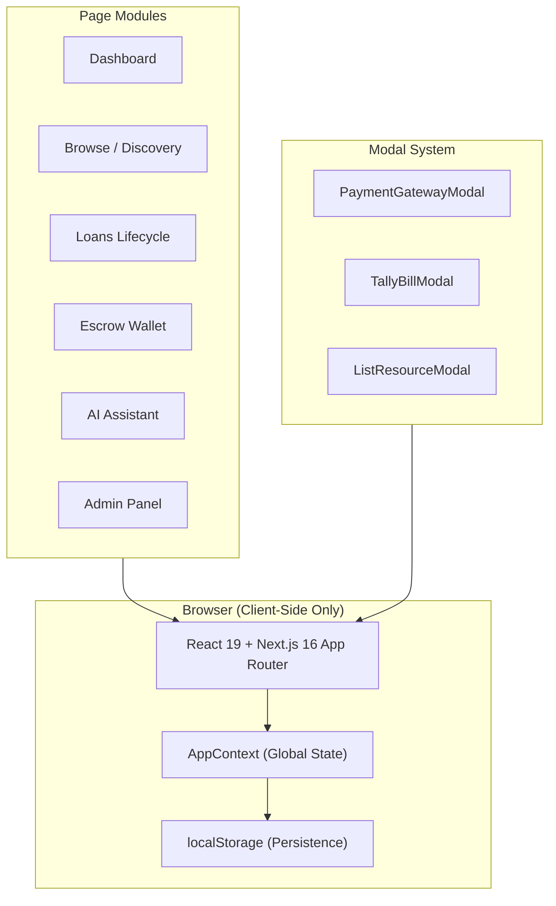

<div align="center">


### _From Ownership to Access — Why buy what someone nearby already has?_

A peer-to-peer resource sharing platform built for college campuses.  
Discover, share, lend, borrow & settle equipment exchanges — all within your campus community.

[](https://nextjs.org/)
[](https://react.dev/)
[](https://www.typescriptlang.org/)
[](https://tailwindcss.com/)
[](https://vercel.com)

**Built for Web Fusion 2.0 Hackathon — Thakur College of Engineering & Technology (TCET)**

[](https://vercel.com/new/clone?repository-url=https%3A%2F%2Fgithub.com%2FSC136%2FWeb_Fusion_2.0)

</div>

---

## 📋 Table of Contents

- [Problem Statement](#-problem-statement)
- [Solution Overview](#-solution-overview)
- [Key Features](#-key-features)
- [Tech Stack](#-tech-stack)
- [Getting Started](#-getting-started)
- [Project Structure](#-project-structure)
- [Pages & Routes](#-pages--routes)
- [Demo Accounts](#-demo-accounts)
- [Architecture](#-architecture)
- [Team](#-team)

---

## 🎯 Problem Statement

College students frequently need resources — cameras, calculators, laptops, textbooks, sports equipment, musical instruments — **for just a few days**. At the same time, many of these exact items sit idle with other students on the same campus.

**Campus Circular** solves this by creating a **trusted, escrow-secured digital marketplace** where students can:

- Discover and borrow equipment from peers within walking distance
- List unused resources and earn from their idle inventory
- Complete the full lifecycle — from finding a resource to returning it and settling the exchange
- Trust the process through verified profiles, security deposits, and condition tracking

> _"I need to make a reel for my club event tomorrow."_  
> → The platform recommends: **Camera + Tripod + Microphone + Ring Light** — all available from students in your building.

---

## 💡 Solution Overview

Campus Circular is a **frontend-only** web application that simulates a complete peer-to-peer resource sharing ecosystem. All data is managed client-side using React Context and `localStorage`, with no backend required.

The platform covers the **entire borrowing lifecycle**:

```
Available → Requested → Accepted → Handover → Borrowed → Return Due → Returned → Inspection → Settlement → Rated
```

---

## ✨ Key Features

### 1. 👤 User & Trust Profiles
- Multi-user demo system with switchable student accounts
- Trust scores, verification badges, ratings, exchange history
- Department, year, and campus location details

### 2. 📦 Resource Listing & Management
- List resources with images, descriptions, categories, condition ratings
- Set daily rental charges, security deposits, and borrowing terms
- Pause, resume, or permanently delete your own listings
- Upload custom images for listed items

### 3. 🔍 Resource Discovery & Browsing
- Browse a categorized marketplace with search, filters, and sorting
- Filter by category, availability, condition, distance, and price range
- Grid and list view modes

### 4. 🤖 AI-Assisted Smart Discovery
- Describe your need in natural language: _"I need gear for a YouTube shoot"_
- AI identifies and bundles the optimal set of resources (camera + mic + tripod + lighting)
- Smart matching considers availability, distance, trust, condition, and cost
- Community "Wanted Board" for posting unfulfilled requests

### 5. 💰 Borrowing Charges & Escrow Security
- Transparent pricing: `Rental Fee + Platform Fee + Refundable Security Deposit = Total`
- Refundable security deposits locked in a simulated Campus Escrow Vault
- Late fee calculations and damage deduction workflows
- Platform fee (configurable) reflected across all transactions

### 6. 💳 Mock Payment Gateway
Full-featured simulated banking interface with 4 payment modes:
- **UPI Instant Pay** — VPA input, 1-click autocomplete chips, live QR code with countdown
- **Campus Smart ID** — Institutional card balance with 0% fee tap-to-pay
- **Debit / Credit Card** — Interactive Visa/RuPay card form with validation
- **NetBanking** — SBI, HDFC, ICICI, Axis Bank partner selection

### 7. 🏦 Campus Escrow Wallet (`/wallet`)
- Available balance, locked escrow, lender earnings, trust tier metrics
- Top-up simulator (₹500 / ₹1,000 / ₹2,500 via UPI or NetBanking)
- Withdraw payouts to linked bank account with mock UTR confirmation
- Filterable peer escrow ledger with receipt popup for every entry

### 8. 📊 9-Stage Borrowing Lifecycle Tracker (`/loans`)
Visual progress through all 9 stages:
1. **Requested** → 2. **Accepted** → 3. **Escrow Locked** → 4. **Handover**
5. **Active Borrow** → 6. **Return Initiated** → 7. **Inspection**
8. **Financial Settlement** → 9. **Completed & Rated**

Stage 8 includes a dedicated **Campus Escrow Banking Settlement Portal** with:
- Refund destination selector (Wallet / UPI / Bank Account)
- Transparent escrow audit table
- 3-step banking switch settlement animation
- Official settlement voucher generation

### 9. 📜 Tally ERP-Style Tax Invoice & Receipts
Professional institutional invoices, not generic page prints:
- TCET institutional header with AICTE/Autonomous affiliation
- Itemized Tally ledger grid (HSN/SAC, duration, rate, amounts)
- Amount-in-words auto-generation
- Official seal & signatory block
- **Print to A4 PDF** or **Download as standalone `.html`**

### 10. 🌿 Carbon Impact Dashboard
- CO₂ savings calculation with scientific methodology
- Per-item carbon avoidance breakdown
- Real-world equivalents (km driving avoided, phone recharges)
- Interactive hover tooltip with calculation formula

### 11. 💬 Peer Messaging System (`/messages`)
- Real-time simulated chat threads between borrowers and lenders
- Thread creation from product detail pages
- Unread count badges and conversation history

### 12. 🛡️ Admin Panel (`/admin`)
- Separate admin login and dashboard
- User management, resource approval/rejection
- Exchange monitoring, overdue tracking
- Dispute management and platform statistics

### 13. 📱 Fully Responsive Design
- Desktop sidebar navigation with persistent layout
- Mobile bottom navigation bar with drawer menu
- Touch-optimized interactions and micro-animations
- Clay-style 3D mascot illustrations throughout

---

## 🛠 Tech Stack

| Layer | Technology |
|-------|-----------|
| **Framework** | Next.js 16.3 (App Router) |
| **Language** | TypeScript 5 |
| **UI Library** | React 19.2 |
| **Styling** | Tailwind CSS 4 |
| **Charts** | Recharts 3.10 |
| **State Management** | React Context + localStorage |
| **Icons** | Custom SVG icon system (`AppIcon`) |
| **Fonts** | Inter (Google Fonts) |
| **Package Manager** | npm |

---

## 🚀 Getting Started

### Prerequisites

- **Node.js** ≥ 18.x
- **npm** ≥ 9.x

### Installation

```bash
# Clone the repository
git clone https://github.com/SC136/Web_Fusion_2.0.git
cd Web_Fusion_2.0

# Install dependencies
npm install

# Start the development server
npm run dev
```

Open [http://localhost:3000](http://localhost:3000) in your browser.

### Other Commands

```bash
npm run build    # Production build
npm run start    # Start production server
npm run lint     # Run ESLint
```

### Deploy to Vercel

The fastest way to go live — click the button or use the CLI:

[](https://vercel.com/new/clone?repository-url=https%3A%2F%2Fgithub.com%2FSC136%2FWeb_Fusion_2.0)

**Or deploy via CLI:**

```bash
# Install Vercel CLI
npm i -g vercel

# Deploy (follow the prompts)
vercel
```

> **Note:** This is a fully client-side app with no environment variables or backend dependencies. It deploys out-of-the-box — just connect the repo and hit deploy.

---

## 📁 Project Structure

```
my-app/
├── app/
│   ├── admin/              # Admin panel & dashboard
│   ├── ai-assistant/       # AI-powered smart resource discovery
│   ├── browse/             # Marketplace catalog
│   │   └── [id]/           # Individual product detail page
│   ├── components/
│   │   ├── dashboard/      # Sidebar, Icons, MobileDrawer, MobileBottomNav
│   │   ├── layout/         # AppNavbar, shared layout components
│   │   └── modals/         # ListResourceModal, PaymentGatewayModal, TallyBillModal
│   ├── context/            # AppContext (global state, users, listings, exchanges)
│   ├── dashboard/          # Main student dashboard
│   ├── data/               # Mock data (products, categories, recommended items)
│   ├── help/               # Help & FAQ center
│   ├── how-it-works/       # Platform guide / onboarding
│   ├── impact/             # Campus sustainability & CO₂ impact dashboard
│   ├── listings/           # My Listed Resources management
│   ├── loans/              # 9-stage borrowing lifecycle tracker
│   ├── login/              # Authentication & demo account switcher
│   ├── messages/           # Peer-to-peer chat system
│   ├── product/            # Product pages
│   ├── profile/            # User profile & trust score
│   ├── requests/           # Incoming borrow requests & Wanted Board
│   ├── utils/              # Utilities (printBill.ts for Tally invoices)
│   ├── wallet/             # Campus Escrow Wallet & ledger
│   ├── globals.css         # Global styles & design tokens
│   ├── layout.tsx          # Root layout with AppProvider
│   └── page.tsx            # Landing page (Hero Section)
├── public/
│   ├── mascots/            # 3D clay mascot illustrations
│   ├── products/           # Product placeholder images
│   └── *.png               # UI assets (login card, sidebar, backgrounds)
├── package.json
├── tsconfig.json
├── tailwind.config.ts
└── next.config.ts
```

---

## 🗺 Pages & Routes

| Route | Description |
|-------|-------------|
| `/` | Landing page with hero section and mascot illustrations |
| `/login` | Student authentication with 3 demo account quick-switcher |
| `/dashboard` | Main dashboard — stats, recent activity, CO₂ impact widget |
| `/browse` | Marketplace catalog with search, filters, and category tabs |
| `/browse/[id]` | Product detail — images, pricing, borrowing agreement, owner chat |
| `/listings` | Manage your listed resources — pause, delete, upload images |
| `/loans` | 9-stage borrowing lifecycle tracker with escrow settlement |
| `/wallet` | Campus Escrow Wallet — balance, ledger, top-up, withdraw |
| `/messages` | Peer-to-peer chat threads with borrowers/lenders |
| `/requests` | Incoming borrow requests & community Wanted Board |
| `/ai-assistant` | AI-powered natural language resource discovery & kit bundling |
| `/impact` | Campus sustainability metrics & carbon savings dashboard |
| `/profile` | Student profile, trust score, verification, and exchange history |
| `/how-it-works` | Platform guide and onboarding walkthrough |
| `/help` | Help center & FAQ |
| `/admin` | Admin panel — user/resource management, disputes, analytics |

---

## 👥 Demo Accounts

The platform comes with 3 pre-configured student accounts for testing:

| Account | Name | Role | Department |
|---------|------|------|------------|
| **Anaya Sharma** | `anaya.sharma@thakurcollege.edu.in` | Borrower | 3rd Year, Computer Science |
| **Aarav Mehta** | `aarav.mehta@thakurcollege.edu.in` | Lender | 4th Year, Mechanical Engineering |
| **Kabir Verma** | `kabir.verma@thakurcollege.edu.in` | Lender | 2nd Year, EXTC |

Switch between accounts instantly from the login page or via the sidebar profile switcher.

---

## 🏗 Architecture



### State Management

All application state flows through a single `AppContext` provider:

- **Users**: Multi-user system with instant switching
- **Listings**: CRUD operations with localStorage sync
- **Exchanges**: Full lifecycle state machine (9 stages)
- **Messages**: Thread-based chat system
- **Wallet**: Balance tracking, ledger entries, top-ups

---

## 👨‍💻 Team

**Team SC136** — Web Fusion 2.0 Hackathon, TCET

<table>
  <tr>
    <td align="center">
      <a href="https://github.com/SC136">
        <br />
        <sub><b>Swar</b></sub>
      </a><br />
      <sub>@SC136</sub>
    </td>
    <td align="center">
      <a href="https://github.com/WillyEverGreen">
        <br />
        <sub><b>Balkawade Sai Dipak</b></sub>
      </a><br />
      <sub>@WillyEverGreen</sub>
    </td>
  </tr>
</table>

---

<div align="center">

_Built with ❤️ for the campus community_

**Campus Circular** — Making sharing practical, safe, and convenient.

</div>
